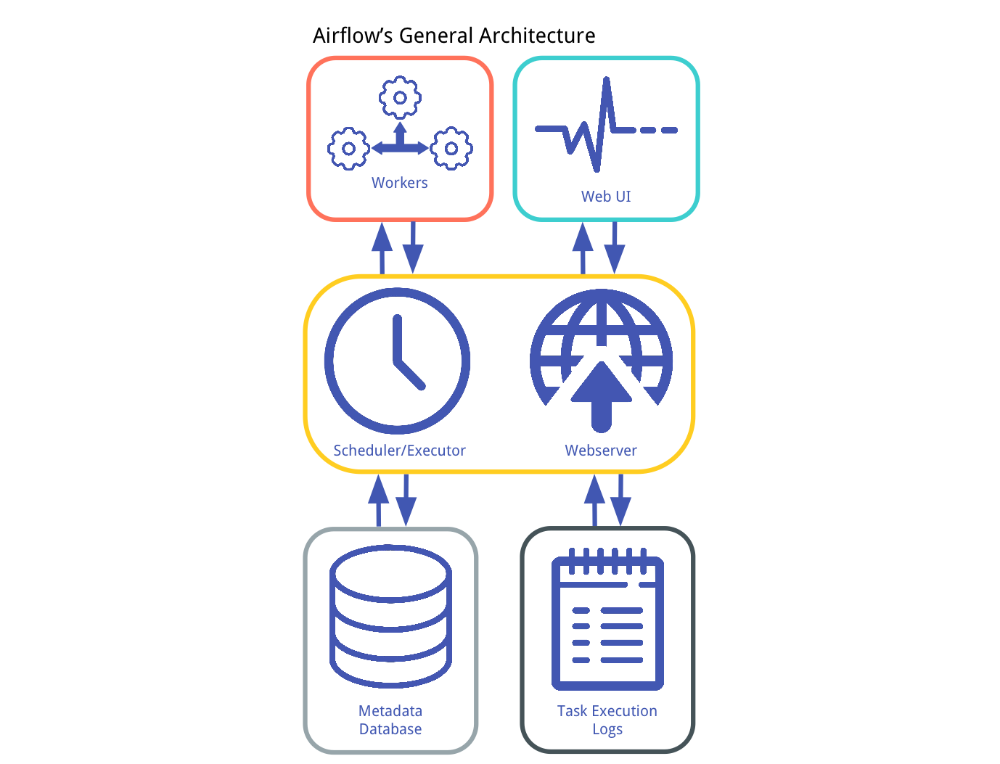

# airflow-kubernetes
This Project contains the script (Kubernetes mainfest files) to deploy the HA cluster.

# **Airflow**

### **What is Apache Airflow**

| Airflow Platform created by the community to programmatically author, schedule and monitor workflows.

Use Airflow to author workflows as Directed Acyclic Graphs (DAGs) of tasks. The Airflow scheduler executes your tasks on an array of workers while following the specified dependencies

### **Principles**

* Dynamic
* Extensible
* Elegant
* Scalable

### **Use Case of Airflow**

Airflow is not a data streaming solution. The Workflows are expected to be mostly static or slowly changing.

### **Running Airflow**

Airflow can be installed and run by two methods:
1. Local Installation
2. Docker Installtion

As a third options we also get ready-made managed solution like MWAA in aws etc.,.

### **Airflow with Kubernetes**

Kubernetes gives an advantage in your environment, especially if you are optimizing app dev for the cloud, is that it gives you the platform to schedule and run containers on clusters of physical or virtual machines (VMs).

Let's see the bunch of advantages we get on running Airflow over Kubernetes.

#### _Scalability_

Airflow runs one worker pod per airflow task, enabling Kubernetes to spin up and destroy pods depending on the load.

#### _Resource Optimization_

Kubernetes spins up worker pods only when there is a new job. Whereas the alternatives such as celery always have worker pods running to pick up tasks as they arrive.

### __Airflow’s Architecture__

At its core, Airflow is simply a queuing system built on top of a metadata database. The database stores the state of queued tasks and a scheduler uses these states to prioritize how other tasks are added to the queue. This functionality is orchestrated by four primary components.

1. __Metadata Database__: This database stores information regarding the state of tasks. Database updates are performed using an abstraction layer implemented in SQLAlchemy. This abstraction layer cleanly separates the function of the remaining components of Airflow from the database.
2. __Scheduler__: The Scheduler is a process that uses DAG definitions in conjunction with the state of tasks in the metadata database to decide which tasks need to be executed, as well as their execution priority. The Scheduler is generally run as a service.
3. __Executor__: The Executor is a message queuing process that is tightly bound to the Scheduler and determines the worker processes that actually execute each scheduled task. There are different types of Executors, each of which uses a specific class of worker processes to execute tasks. For example, the LocalExecutor executes tasks with parallel processes that run on the same machine as the Scheduler process. Other Executors, like the CeleryExecutor execute tasks using worker processes that exist on a separate cluster of worker machines.
4. __Workers__: These are the processes that actually execute the logic of tasks, and are determined by the Executor being used.

~~For more leaning, do refer the offical page of Apache Airflow. I have shared the link under the reference heading~~

### Executor

Executors are the mechanism by which task instances get run. They have a common API and are "pluggable", meaning you can swap executors based on your installation needs.

Airflow can only have one executor configured at a time; this is set by the executor option in the [core] section of the configuration file.

There are different kinds of Executors one can use with Airflow.

_Local Executors_

* Debug Executor
* Local Executor
* Sequential Executor

_Remote Executors_

* Celery Executor
* CeleryKubernetes Executor
* Dask Executor
* Kubernetes Executor

Since our topic is about setting up Airflow on Kubernetes, I am very much intereseted in ** _Kubernetes Executor_ **

The kubernetes executor is introduced in Apache Airflow 1.10.0. The Kubernetes executor will create a new pod for every task instance.

In other words, On scheduling a task with airflow Kubernetes executor, the scheduler spins up a pod and runs the tasks. On completion of the task, the pod gets killed. It ensures maximum utilization of resources, unlike celery, which at any point must have a minimum number of workers running.

